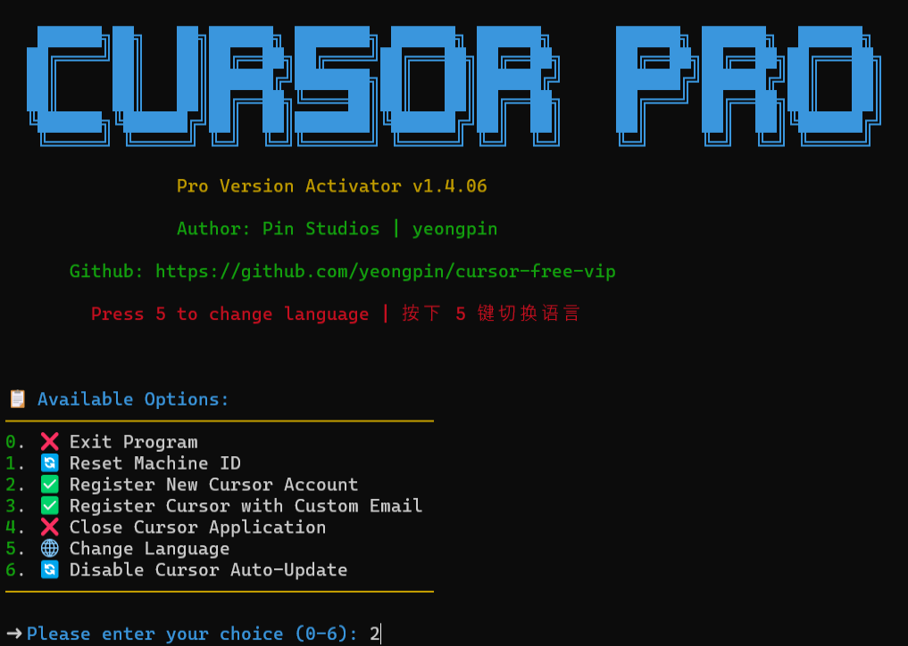

# 🚀 Cursor VIP 授权工具

<div align="center">
<p align="center">
  
</p>

<h3>让你的 Cursor 畅享 VIP 体验</h3>
<h4>完美支持最新 0.47.x 版本</h4>

<p align="center">
  <br>
</p>
</div>

## 📖 简介

这是一款强大的自动化工具，能帮你轻松搞定 Cursor 编辑器的会员认证。它可以自动注册、完成身份验证，并重置 Cursor 的配置信息，让你享受到完整的功能体验。

## ✨ 主要功能

- 🌟 **谷歌账号认证**：使用 Google OAuth 实现终身授权
- ⭐ **GitHub 账号认证**：通过 GitHub OAuth 获得永久访问权限
- 🔄 **自动注册**：全自动完成 Cursor 会员注册流程
- 🖥️ **多系统支持**：完美兼容 Windows 和 macOS 系统
- 🔐 **身份验证**：自动完成 Auth 验证过程
- 🧹 **配置重置**：一键重置 Cursor 的配置信息
- 🌍 **多语言界面**：支持英文、简体中文、繁体中文和越南语

## 💻 系统兼容性

| 操作系统 | 架构 | 支持状态 |
|:-------:|:-----:|:-----:|
| Windows | x64 | ✅ 支持 |
| Windows | x86 | ✅ 支持 |
| macOS | Intel 芯片 | ✅ 支持 |
| macOS | Apple 芯片 | ✅ 支持 |
| Linux | x64 | ✅ 支持 |
| Linux | x86 | ✅ 支持 |
| Linux | ARM64 | ✅ 支持 |

## 🚀 快速开始

> ⚠️ **注意**：运行前请确保已关闭 Cursor 编辑器，并使用管理员权限执行脚本

### Windows 用户

只需复制下面的命令到 PowerShell 中执行：

```powershell
irm https://raw.githubusercontent.com/suinian0309/CursorVip/main/scripts/install.ps1 | iex
```

### macOS/Linux 用户

在终端中执行以下命令：

```bash
curl -fsSL https://raw.githubusercontent.com/suinian0309/CursorVip/main/scripts/install.sh -o install.sh && chmod +x install.sh && ./install.sh
```

### 手动重置机器标识

如果需要重置机器标识，可以使用以下命令：

**Windows**:
```powershell
irm https://raw.githubusercontent.com/suinian0309/CursorVip/main/scripts/reset.ps1 | iex
```

**macOS/Linux**:
```bash
curl -fsSL https://raw.githubusercontent.com/suinian0309/CursorVip/main/scripts/reset.sh | sudo bash
```

> 💡 **小贴士**：如果想停止脚本运行，按下 Ctrl+C 即可

## ⚙️ 配置说明

配置文件位置：`Documents/.cursorvip/config.ini`

<details>
<summary><b>👉 点击查看详细配置选项</b></summary>

```
[Chrome]
# 谷歌浏览器路径
chromepath = C:\Program Files\Google/Chrome/Application/chrome.exe

[Turnstile]
# 人机验证等待时间
handle_turnstile_time = 2
# 人机验证随机等待时间（格式：1-3 或 1,3）
handle_turnstile_random_time = 1-3

[OSPaths]
# 存储文件路径
storage_path = /Users/username/Library/Application Support/Cursor/User/globalStorage/storage.json
# SQLite数据库路径
sqlite_path = /Users/username/Library/Application Support/Cursor/User/globalStorage/state.vscdb
# 机器ID路径
machine_id_path = /Users/username/Library/Application Support/Cursor/machineId

[Timing]
# 最小随机时间
min_random_time = 0.1
# 最大随机时间
max_random_time = 0.8
# 页面加载等待时间
page_load_wait = 0.1-0.8
# 输入等待时间
input_wait = 0.3-0.8
# 提交等待时间
submit_wait = 0.5-1.5
# 验证码输入等待时间
verification_code_input = 0.1-0.3
# 验证成功等待时间
verification_success_wait = 2-3
# 验证重试等待时间
verification_retry_wait = 2-3
# 邮件检查初始等待时间
email_check_initial_wait = 4-6
# 邮件刷新等待时间
email_refresh_wait = 2-4
# 设置页面加载等待时间
settings_page_load_wait = 1-2
# 失败重试时间
failed_retry_time = 0.5-1
# 重试间隔
retry_interval = 8-12
# 最大超时时间
max_timeout = 160
```
</details>

## 🔍 常见问题

| 问题描述 | 解决方法 |
|:--------------------------------------------------:|:------------------------------------------------:|
| 遇到权限不足问题 | 请确保以管理员身份运行脚本 |
| 脚本无法正常运行 | 请确保已安装谷歌浏览器，可从[这里下载](https://www.google.com/intl/en_pk/chrome/) |
| 验证失败 | 检查网络连接，确保能正常访问谷歌或GitHub |

## 📝 更新日志

想了解最新版本的更新内容？[点击这里查看完整更新记录](CHANGELOG.md)

## ⭐ 项目统计

<div align="center">

[](https://star-history.com/#suinian0309/CursorVip&Date)

</div>

## 👥 加入交流群

<div align="center">
  <p>扫描下方二维码，加入微信交流群，获取最新资讯和使用技巧</p>
  
  <p>👆 微信扫一扫，和开发者及其他用户一起交流 👆</p>
  <p>二维码失效？请<a href="https://github.com/suinian0309/CursorVip/issues">提交 Issue</a> 获取最新二维码</p>
</div>

## ⚠️ 免责声明

本工具仅供学习和研究使用，请在合法范围内使用。使用本工具产生的任何后果由使用者自行承担。请尊重软件开发者的劳动成果，遵守相关软件使用条款。
此项目部分功能参考了[cursor-free-vip](https://github.com/yeongpin/cursor-free-vip)项目，在此表示感谢。

## 📄 许可协议

本项目采用 [CC BY-NC-ND 4.0](https://creativecommons.org/licenses/by-nc-nd/4.0/) 许可协议。详情请参阅 [LICENSE](LICENSE.md) 文件。
