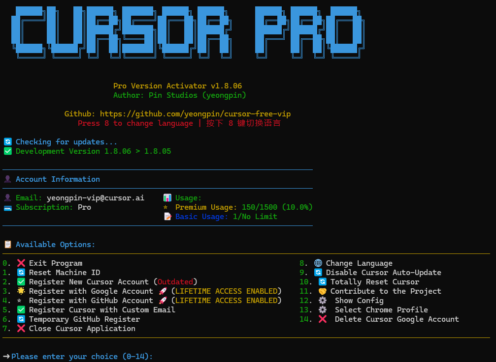

# ➤ Cursor VIP 工具

<div align="center">
<p align="center">
  
</p>

<p align="center">

[](https://github.com/suinian0309/cursorvip/releases/latest)
[](https://creativecommons.org/licenses/by-nc-nd/4.0/)
[](https://github.com/suinian0309/cursorvip/stargazers)
[](https://github.com/suinian0309/cursorvip/releases/latest)

</p>
<h4>支持最新 Cursor 0.48.x 版本</h4>

<p align="center">
  <br>
</p>

</div>

## 📋 项目简介

Cursor VIP 是一个功能强大的 Cursor 编辑器增强工具，提供机器标识重置、账户管理和系统配置等功能。本工具支持 Windows、macOS 和 Linux 系统，为用户提供流畅的 Cursor 使用体验。

为获得最佳性能，请使用管理员/root权限运行，并保持工具版本更新。

## 🔄 更新日志

[查看完整更新日志](CHANGELOG.md)

## ✨ 核心功能

### 账户管理
* 🔑 **手动注册** - 支持手动注册 Cursor 账户
* 🗑 **删除 Google 账户** - 安全删除关联的 Cursor Google 账户

### 系统维护
* 🔄 **重置机器标识** - 重置 Cursor 的机器标识信息
* 🔄 **完全重置** - 彻底清除 Cursor 配置和数据
* ⛔ **禁用自动更新** - 阻止 Cursor 自动更新
* 🔄 **绕过版本检查** - 绕过 Cursor 版本限制

### 实用工具
* ❌ **退出 Cursor 进程** - 强制结束所有 Cursor 运行进程
* ⚙️ **配置管理** - 查看和编辑工具配置
* 🌐 **多语言支持** - 支持英文、简体中文、繁体中文、越南语等
* ⚙️ **Chrome 配置文件选择** - 灵活选择浏览器配置文件

## 💻 系统支持

### 支持的操作系统

| 操作系统 | 架构 | 支持状态 |
|:----------:|:--------------------:|:----------:|
| Windows | x64 (64位) | ✅ |
| Windows | x86 (32位) | ✅ |
| macOS | Intel | ✅ |
| macOS | Apple Silicon (M1/M2/M3) | ✅ |
| Linux | x64 (64位) | ✅ |
| Linux | x86 (32位) | ✅ |
| Linux | ARM64 | ✅ |

### 支持的 Cursor 版本

| Cursor 版本 | 支持状态 | 备注 |
|:-------------:|:----------:|:--------------------:|
| 0.48.x | ✅ | 完全支持 |
| 0.47.x | ✅ | 完全支持 |
| 0.46.x | ✅ | 完全支持 |
| 0.45.x 及以下 | ✅ | 需要使用绕过版本检查功能 |

## 👀 使用方法

### 快速安装

<details open>
<summary><b>⭐ 一键安装脚本</b></summary>

**Linux/macOS**

```bash
curl -fsSL https://raw.githubusercontent.com/suinian0309/cursorvip/main/scripts/install.sh -o install.sh && chmod +x install.sh && ./install.sh
```

**Windows**

```powershell
irm https://raw.githubusercontent.com/suinian0309/cursorvip/main/scripts/install.ps1 | iex
```

</details>

### 快速重置

<details>
<summary><b>⭐ 直接重置机器标识</b></summary>

**Linux/macOS**

```bash
curl -fsSL https://raw.githubusercontent.com/suinian0309/cursorvip/main/scripts/reset.sh | sudo bash
```

**Windows**

```powershell
irm https://raw.githubusercontent.com/suinian0309/cursorvip/main/scripts/reset.ps1 | iex
```

</details>

> 提示：要停止正在运行的脚本，请按 Ctrl+C

## ❗ 注意事项

### 配置文件

配置文件路径：`Documents/.cursor-free-vip/config.ini`

<details>
<summary><b>⭐ 配置文件详情</b></summary>

```ini
[Chrome]
# Google Chrome 浏览器路径
chromepath = C:\Program Files\Google/Chrome/Application/chrome.exe

[Turnstile]
# 人机验证等待时间
handle_turnstile_time = 2
# 人机验证随机等待时间（格式：1-3 或 1,3）
handle_turnstile_random_time = 1-3

[OSPaths]
# 存储路径
storage_path = /Users/username/Library/Application Support/Cursor/User/globalStorage/storage.json
# SQLite数据库路径
sqlite_path = /Users/username/Library/Application Support/Cursor/User/globalStorage/state.vscdb
# 机器ID路径
machine_id_path = /Users/username/Library/Application Support/Cursor/machineId
# Linux用户路径: ~/.config/cursor/machineid

[Timing]
# 时间相关配置
min_random_time = 0.1
max_random_time = 0.8
page_load_wait = 0.1-0.8
input_wait = 0.3-0.8
submit_wait = 0.5-1.5
verification_code_input = 0.1-0.3
verification_success_wait = 2-3
verification_retry_wait = 2-3
email_check_initial_wait = 4-6
email_refresh_wait = 2-4
settings_page_load_wait = 1-2
failed_retry_time = 0.5-1
retry_interval = 8-12
max_timeout = 160

[Utils]
# 工具设置
check_update = True
show_account_info = True
```

</details>

### 使用注意事项

* **管理员权限** - 请使用管理员/root权限运行工具
* **关闭 Cursor** - 运行工具前请先关闭 Cursor 编辑器
* **仅供学习研究** - 本工具仅供学习和研究使用
* **遵守条款** - 使用本工具时请遵守相关软件使用条款

## 🚨 常见问题

| 问题 | 解决方法 |
|:--------------------------------------------------:|:------------------------------------------------:|
| 权限问题 | 请使用管理员/root权限运行工具 |
| “User is not authorized” 错误 | 账户因使用临时邮箱被禁用，请使用非临时邮箱服务 |
| Linux路径未找到 | 检查Cursor安装路径或使用root权限运行 |
| 浏览器启动失败 | 确保已安装Google Chrome并正确配置路径 |

## 📩 免责声明

本工具仅供学习和研究使用，使用本工具所产生的任何后果由使用者自行承担。

This tool is only for learning and research purposes, and any consequences arising from the use of this tool are borne by the user.

## 💰 支持项目

<div align="center">
  <table>
    <tr>
      <td>
        <br>
      </td>
  </table>
</div>

## ⭐ 项目统计

<div align="center">

[](https://star-history.com/#suinian0309/cursorvip&Date)

</div>

## 📝 致谢

本项目部分代码参考 [此项目](https://github.com/yeongpin/cursor-free-vip)，在此表示感谢。

## 📝 许可证

本项目采用 [CC BY-NC-ND 4.0](https://creativecommons.org/licenses/by-nc-nd/4.0/) 许可证。
详细信息请参考 [LICENSE](LICENSE.md) 文件。
